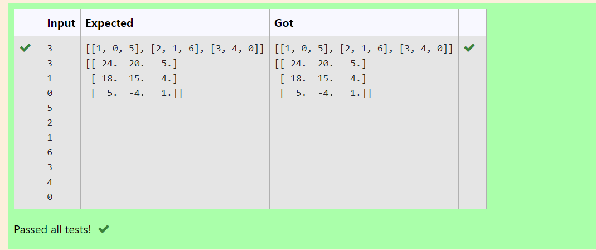

# Inverse-of-matrix

## AIM:To write a program to perform inverse of a matrix using python programing.

## ALGORITHM:
### Step 1:import numpy as np.
### Step 2:Declare a variable l1 as an empty list. 
### Step 3:Declare a variable l2 as an empty list. 
### Step 4:Get input variables as n and m.
### Step 5:Loop a variable i in range of n and nest loop a variable j in range m.
### Step 6:get the values of num variable.
### Step 7:During the loop app append the num values to l1 values to list l2.
### Step 8:Declare a variable inverse using numpy modules linalg and inv functions find the inverse l2. 
### Step 9:Print the value of inverse.

## PROGRAM:
import numpy as np
l1,l2=[],[]
n1,n2=int(input()),int(input())
for i in range (n1):
    for j in range (n2):
       values=int(input())
       l1.append(values)
    l2.append(l1)
    l1=[]
print(l2)
matrix=np.array(l2)
inverse=np.linalg.inv(matrix)
print(inverse)

## OUTPUT:

## RESULT:
